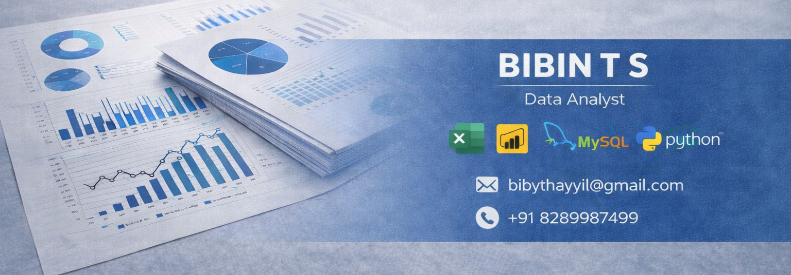
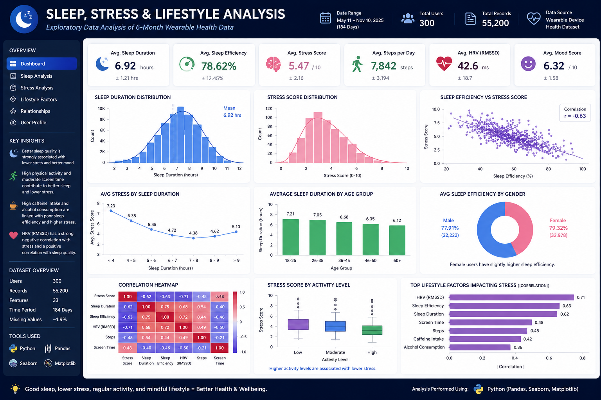
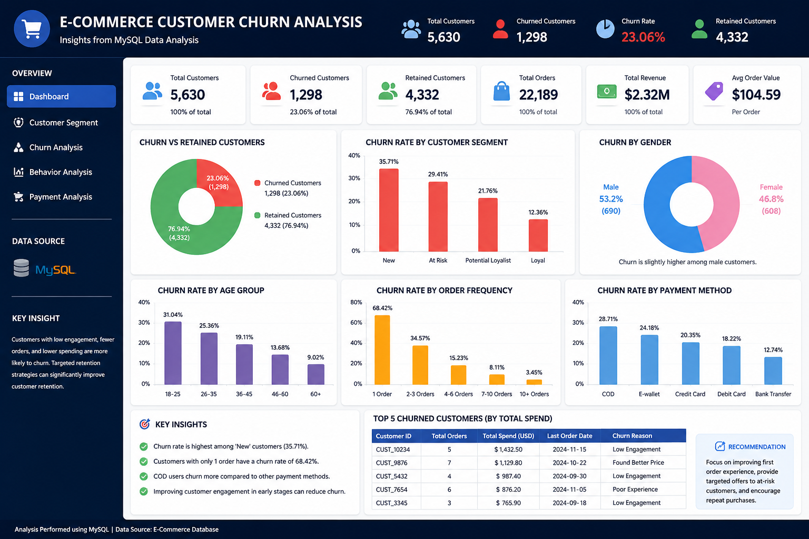
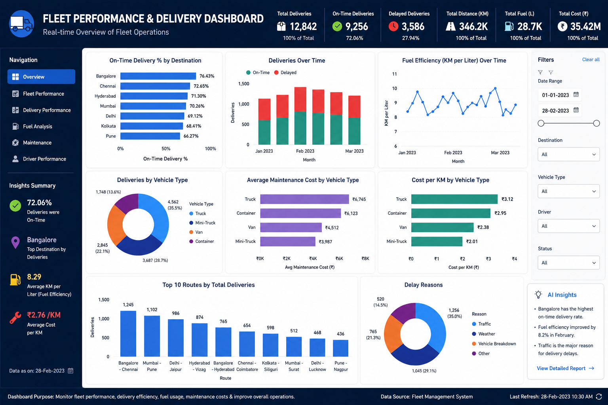
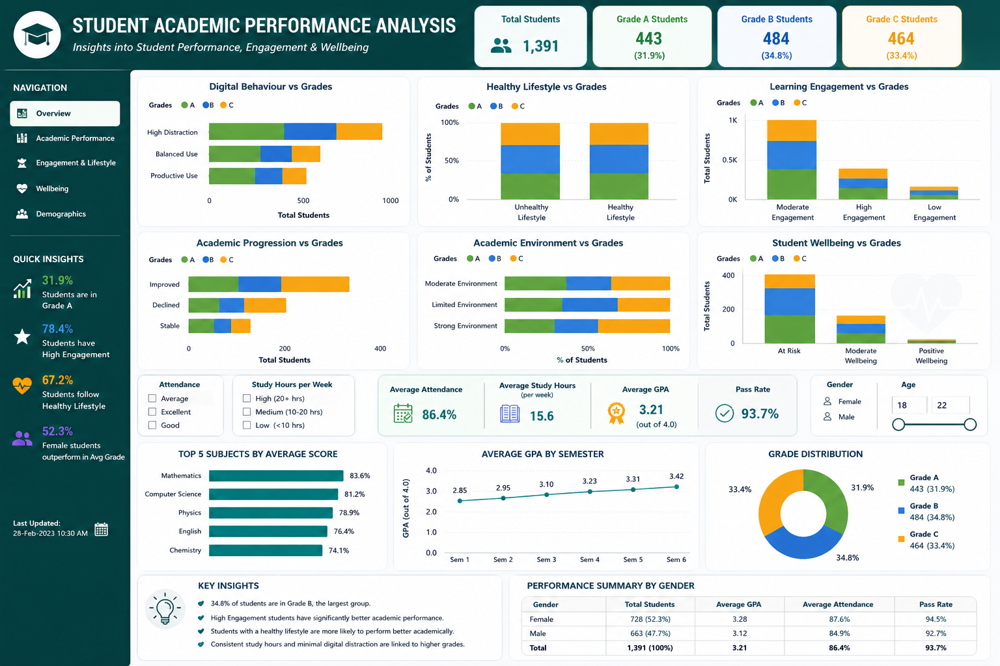
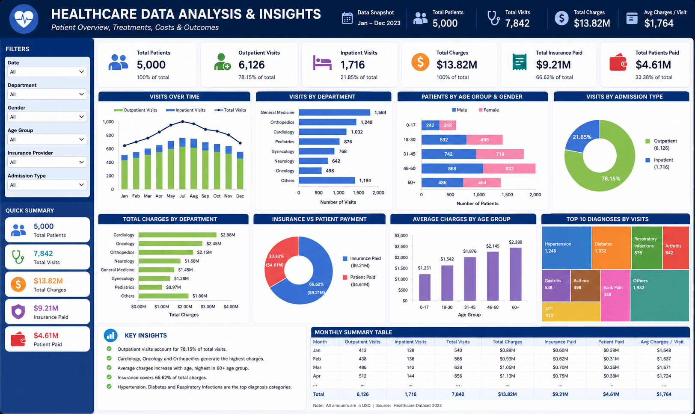

  

<h1 align="center">Hi 👋, I'm Bibin T S</h1>

<h3 align="center">
Healthcare Professional → Data Analyst
</h3>

Python • MySQL • Power BI • Excel • Healthcare Analytics

---

## 👨‍💻 About Me

I am a BHMS graduate and aspiring Data Analyst with a completed Data Analytics certification and hands-on experience in Python, MySQL, Power BI, and Excel.

My unique combination of healthcare expertise and analytical skills enables me to understand complex datasets, uncover actionable insights, and communicate findings effectively through dashboards and visualizations.

I am currently seeking opportunities as a Data Analyst in any sector, with a particular interest in Healthcare Analytics, Clinical Data Management, Business Intelligence, and data-driven problem solving.

📍 Kerala, India

---

## 🛠️ Tech Stack

### Data Analytics & Visualization

### Business Intelligence

### Database

---

## 🚀 Featured Projects

### 📊 Sleep, Stress & Lifestyle Analysis

  

**Tools:** Python, Pandas, Seaborn, Matplotlib

- Analysed 55,200 wearable health records
- Explored relationships between sleep, stress, activity and lifestyle
- Generated insights using EDA and statistical visualization

🔗 Repository:
https://github.com/bibythayyil/sleep-stress-lifestyle-analysis-python

---

### 🛒 E-Commerce Customer Churn Analysis

  

**Tools:** MySQL

- Analysed 5,630 customer records
- Performed customer segmentation and churn analysis
- Identified retention opportunities through SQL queries

🔗 Repository:
https://github.com/bibythayyil/ecommerce-customer-churn-analysis-mysql

---

### 🚚 Fleet Performance & Delivery Dashboard

  

**Tools:** Power BI, DAX

- Analysed fleet efficiency and delivery performance
- Monitored fuel usage, maintenance costs and on-time delivery
- Built interactive dashboards and KPI tracking

🔗 Repository:
https://github.com/bibythayyil/fleet-performance-delivery-analysis-powerbi

---

### 🎓 Student Academic Performance Analysis

  

**Tools:** Excel, Power BI

- Examined factors affecting student performance
- Analysed engagement, wellbeing and lifestyle indicators
- Developed interactive educational dashboards

🔗 Repository:
https://github.com/bibythayyil/student-academic-performance-analysis-excel-powerbi

---

### 🏥 Healthcare Analysis & Insights

  

**Tools:** Excel

- Analysed healthcare records and treatment trends
- Evaluated patient demographics and healthcare costs
- Developed analytical dashboards and insights

🔗 Repository:
https://github.com/bibythayyil/healthcare-analysis-excel

---

## 📈 GitHub Statistics

  
  

---

## 🎯 Career Interests

- Healthcare Analytics
- Business Intelligence
- Clinical Data Management
- Data Visualization
- Healthcare AI Applications
- Evidence-Based Healthcare

---

## 📫 Connect With Me

